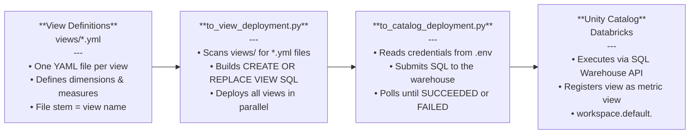

# Databricks API Experiments

Small Python scripts for testing Databricks REST APIs against a Unity Catalog
workspace.

## Setup

Install dependencies:

```bash
pip install requests python-dotenv PyYAML
```

Create a local `.env` file:

```env
TOKEN=your_databricks_pat
DATABRICKS_HOST=https://your-workspace.cloud.databricks.com
DATABRICKS_WAREHOUSE_ID=your_sql_warehouse_id
DATABRICKS_TABLE_FULL_NAME=workspace.default.ingestion_events
```

`.env` is ignored by git because it contains secrets.

## Main Script

Run:

```bash
python databricks_api.py
```
   
The current `__main__` block updates table properties through the Databricks SQL
Statements API:

```sql
ALTER TABLE `workspace`.`default`.`ingestion_events`
SET TBLPROPERTIES (...)
```

This is implemented by:

```python
update_table_properties_with_sql(table_full_name, properties)
```

Use this for normal Unity Catalog tables where your principal has permission to
alter table metadata.

## View Creation Guideline

### Deployment Flow



> **Note:** All `views/*.yml` files are processed in parallel — dependency order between views is not guaranteed. Deploy dependent views (e.g. a view built on another view) in a separate step after its upstream source exists.

---

Metric view definitions live in `views/` as YAML files. Each file is deployed by
`to_view_deployment.py` with this SQL shape:

```sql
CREATE OR REPLACE VIEW <catalog>.<schema>.<view_name>
WITH METRICS LANGUAGE YAML AS
$$
<yaml view definition>
$$
```

Create one file per view:

```text
views/<view_name>.yml
```

The current script uses the file stem as the view name and deploys it to
`workspace.default`. For example, `views/dummy_view.yml` becomes
`workspace.default.dummy_view`.

Recommended YAML structure:

```yaml
version: 1.1
comment: Short view description
source: workspace.default.source_table_or_view

dimensions:
  - name: dimension_name
    expr: source.column_name
    comment: Dimension description
    display_name: Dimension Name

measures:
  - name: row_count
    expr: COUNT(*)
    comment: Total rows
    display_name: Row Count
```

Guidelines:

- Use lower snake case for file names, view names, dimensions, and measures.
- Set `source` to a fully qualified Unity Catalog table or view.
- Keep SQL expressions in `expr` fields deterministic and scoped to the source.
- When referencing a source column with spaces or special characters, use
  backticks, for example:

  ```yaml
  expr: source.`Column Name`
  ```

- Do not include the `CREATE VIEW` SQL wrapper inside the YAML file; the script
  adds it during deployment.
- Keep dependent views in a separate deployment step unless their upstream
  sources already exist. The script processes all `views/*.yml` files in
  parallel, so dependency order is not guaranteed.

Deploy all view definitions:

```bash
python to_view_deployment.py
```

Before running, make sure `.env` contains `TOKEN`, `DATABRICKS_HOST`, and
`DATABRICKS_WAREHOUSE_ID`. Use a SQL warehouse and principal with permission to
create or replace views in the target catalog and schema.

## External Metadata API

`databricks_api.py` also includes helpers for Databricks external metadata:

```python
create_external_metadata()
list_external_metadata()
```

These call:

```text
POST /api/2.0/lineage-tracking/external-metadata
GET  /api/2.0/lineage-tracking/external-metadata
```

External metadata objects are lineage-tracking securables. They do not create
Unity Catalog tables and do not appear as normal tables in Catalog Explorer.

Required privilege:

```text
CREATE EXTERNAL METADATA on the metastore
```

## Notes

- Databricks `system.*` tables are read-only. You can query them, but you cannot
  update their table properties directly.
- To attach custom metadata to system-table information, create your own table
  or external metadata object and join/reference it separately.
- The Unity Catalog Tables create endpoint accepts `data_source_format` only for
  external Delta table creation. Do not send `data_source_format` for managed
  table creation.
